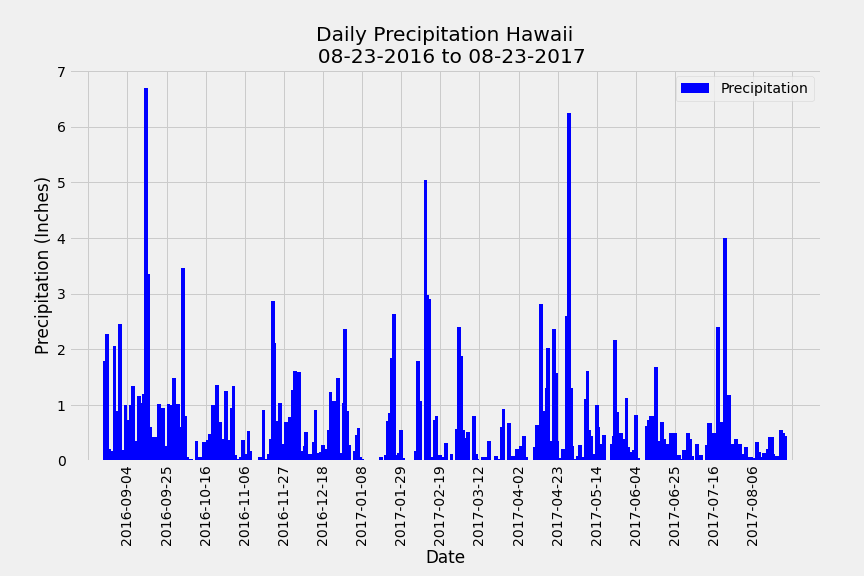
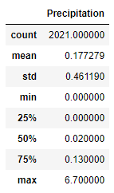
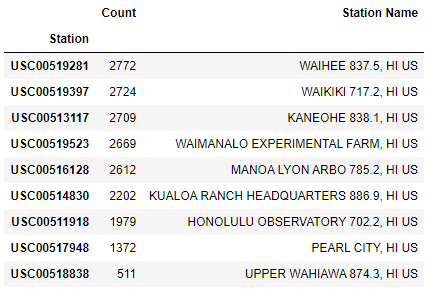
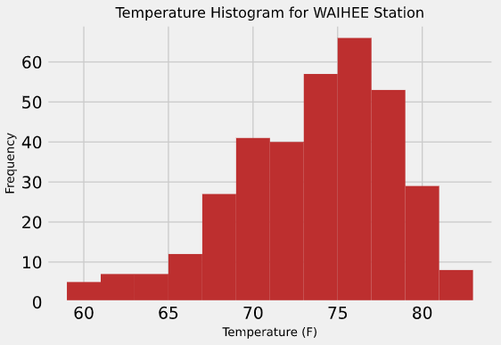
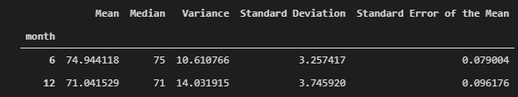
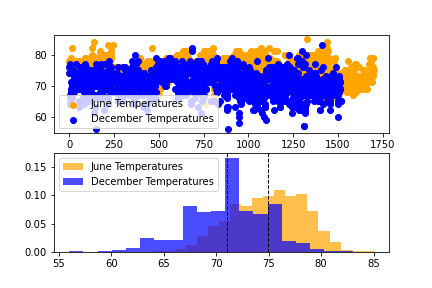
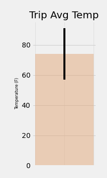

# SQLAlchemy Challenge - Surfs Up!

Congratulations! You've decided to treat yourself to a long holiday vacation in Honolulu, Hawaii! To help with your trip planning, you need to do some climate analysis on the area. 

## Step 1 - Climate Analysis and Exploration

Python and SQLAlchemy were used to do basic climate analysis and data exploration of the hawaii climate database. All of the following analysis were be completed using SQLAlchemy ORM queries, Pandas, and Matplotlib.

* SQLAlchemy `create_engine` used to connect to your sqlite database.

* SQLAlchemy `automap_base()` used to reflect your tables into classes and save a reference to those classes called `Station` and `Measurement`.

* Python linked to the database by creating SQLAlchemy session.

* Closed out session at the end of jupyter notebook.

### Precipitation Analysis

* Most recent date in the data set: 2017-08-23

* Retrieved the last 12 months of precipitation data by querying the 12 preceding months of data. From: 2016-08-23 to 2017-08-23

* Selected only the `date` and `prcp` values.

* Loaded the query results into a Pandas DataFrame and set the index to the date column.

* Sorted the DataFrame values by `date`.

* Ploted the results using the DataFrame `plot` method.

  

* Used Pandas to print the summary statistics for the precipitation data.

  

### Station Analysis

* Design a query to calculate the total number of stations in the dataset.

* Design a query to find the most active stations (i.e. which stations have the most rows?).

  * List the stations and observation counts in descending order.
    
    

  * Which station id has the highest number of observations? 
    - USC00519281	WAIHEE 837.5, HI US (Count: 2772)

  * Using the most active station id, calculate the lowest, highest, and average temperature. (functions `func.min`, `func.max`, `func.avg`, and `func.count` used to find min, max and average.)

    - Lowest temperature: 54.0 F
    - Highest temperature: 85.0 F
    - Average temperature: 71.7 F  

* Designed a query to retrieve the last 12 months of temperature observation data (TOBS).

  * Filtered by the station with the highest number of observations.

  * Queried the last 12 months of temperature observation data for this station.

  * Ploted the results as a histogram with `bins=12`.

    

* Session closed out.

- - -

## Step 2 - Climate App

With the initial analysis completed, designed a Flask API based on the queries from the previous sections.

* Used Flask to create routes.

### Routes

* `/`

  * Home page.

  * Listed all routes that are available.

* `/api/v1.0/precipitation`

  * Converted the query results to a dictionary using `date` as the key and `prcp` as the value.

  * Returned the JSON representation of your dictionary.

* `/api/v1.0/stations`

  * Returned a JSON list of stations from the dataset.

* `/api/v1.0/tobs`
  * Queried the dates and temperature observations of the most active station for the last year of data.

  * Returned a JSON list of temperature observations (TOBS) for the previous year.

* `/api/v1.0/<start>` and `/api/v1.0/<start>/<end>`

  * Returned a JSON list of the minimum temperature, the average temperature, and the max temperature for a given start or start-end range.

  * When given the start only, calculated `TMIN`, `TAVG`, and `TMAX` for all dates greater than and equal to the start date.

  * When given the start and the end date, calculated the `TMIN`, `TAVG`, and `TMAX` for dates between the start and end date inclusive.

## Hints

* You will need to join the station and measurement tables for some of the queries.

* Use Flask `jsonify` to convert your API data into a valid JSON response object.

- - -

### Temperature Analysis I

* Hawaii is reputed to enjoy mild weather all year. Is there a meaningful difference between the temperature in, for example, June and December?

* Use pandas to perform this portion.

* Identify the average temperature in June at all stations across all available years in the dataset. Do the same for December temperature.

  

* Use the t-test to determine whether the difference in the means, if any, is statistically significant. Will you use a paired t-test, or an unpaired t-test? Why?

  - Ttest_indResult(statistic=31.60372399000329, pvalue=3.9025129038616655e-191)
  - Note: Unpaired t-test was used because the sample sizes of the temperatures were unequal. The dataset has more June measurements than December measurments. Got ValueError: unequal length arrays when attempting to run paired (stats.ttest_rel). I ended up running stats.ttest_ind unpaired t-test. 
  
    1. An Independent Samples t-test compares the means for two groups
    2. A Paired sample t-test compares means from the same group at different times.
    
  Null hypothesis: The average temperatures in June and December are the same.
  Alternate hypothosis: The average temperatures in June and December are different.
  
  A p-value close to zero signals that your null hypothesis is false, and typically that a difference is very likely to exist. Large p-values closer to 1 imply that there is no detectable difference for the sample size used.
  
  The pvalue calculated by the t-test returned 3.9025129038616655e-191 (less and 0.05 and very close to zero). We can reject our null hypothesis and accept our alternate hypothesis that the average temperatures in June and December are different.
  
    
    
### Temperature Analysis II

* You are looking to take a trip from August first to August seventh of this year, but are worried that the weather will be less than ideal. Using historical data in the dataset find out what the temperature has previously looked like.

* temp_analysis_bonus1 notebook contains a function called `calc_temps` that will accept a start date and end date in the format `%Y-%m-%d`. The function will return the minimum, average, and maximum temperatures for that range of dates.

* `calc_temps` function was used to calculate the min, avg, and max temperatures for your trip using the matching dates from a previous year (i.e., use "2017-08-01").

* Plotted the min, avg, and max temperature from your previous query as a bar chart.

  * Plot title "Trip Avg Temp"

  * Used the average temperature as the bar height (y value).

  * Used the peak-to-peak (TMAX-TMIN) value as the y error bar (YERR).

    

### Daily Rainfall Average

* Now that you have an idea of the temperature lets check to see what the rainfall has been, you don't want a when it rains the whole time!

* Calculate the rainfall per weather station using the previous year's matching dates.

  * Sort this in descending order by precipitation amount and list the station, name, latitude, longitude, and elevation.

* Calculate the daily normals. Normals are the averages for the min, avg, and max temperatures. You are provided with a function called `daily_normals` that will calculate the daily normals for a specific date. This date string will be in the format `%m-%d`. Be sure to use all historic TOBS that match that date string.

  * Set the start and end date of the trip.

  * Use the date to create a range of dates.

  * Strip off the year and save a list of strings in the format `%m-%d`.

  * Use the `daily_normals` function to calculate the normals for each date string and append the results to a list called `normals`.

* Load the list of daily normals into a Pandas DataFrame and set the index equal to the date.

* Use Pandas to plot an area plot (`stacked=False`) for the daily normals.

  

* Close out your session.